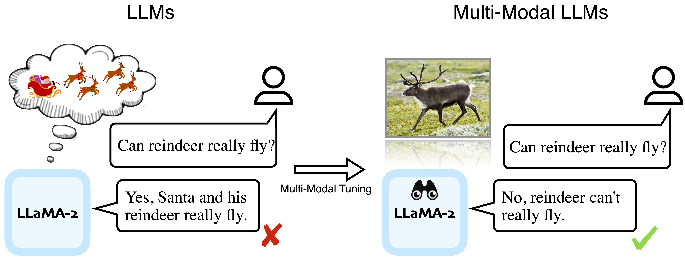

# Sight Beyond Text: Multi-Modal Training Enhances LLMs in Truthfulness and Ethics


[Haoqin Tu*](https://www.haqtu.me/), [Bingchen Zhao*](https://bzhao.me), [Chen Wei](https://weichen582.github.io/), [Cihang Xie](https://cihangxie.github.io/) (*Equal Contribution)


[](https://github.com/tatsu-lab/stanford_alpaca/blob/main/LICENSE)
[](https://github.com/tatsu-lab/stanford_alpaca/blob/main/DATA_LICENSE)

Our paper is online now: https://arxiv.org/abs/2309.07120

<p align="center">
  
</p>

## Installation

Please follow [LLaVA](https://github.com/haotian-liu/LLaVA#install) for setting up the training environment.

## Model Weights

We list all the model and vision-text projector weights used in the paper

| Model          |                               Pretrain Weights                               |                       Instruction Tuned Weights                      |
|----------------|:----------------------------------------------------------------------------:|:--------------------------------------------------------------------:|
| LLaMA-7B       |     [ckpt](https://huggingface.co/PahaII/MM-LLaMA-7B-projector/tree/main)    |     [Finetune ckpt](https://huggingface.co/PahaII/MM-LLaMA-7B-ft)    |
| Vicuna-7B      |    [ckpt](https://huggingface.co/PahaII/MM-Vicuna-7B-projector/tree/main)    |    [Finetune ckpt](https://huggingface.co/PahaII/MM-Vicuna-7B-ft)    |
| LLaMA-3B       |     [ckpt](https://huggingface.co/PahaII/MM-LLaMA-3B-projector/tree/main)    |     [Finetune ckpt](https://huggingface.co/PahaII/MM-LLaMA-3B-ft)    |
|                |                                                                              |      [LoRA ckpt](https://huggingface.co/PahaII/MM-LLaMA-3B-lora)     |
| Alpaca-3B      |    [ckpt](https://huggingface.co/PahaII/MM-Alpaca-3B-projector/tree/main)    |    [Finetune ckpt](https://huggingface.co/PahaII/MM-Alpaca-3B-ft)    |
|                |                                                                              |     [LoRA ckpt](https://huggingface.co/PahaII/MM-Alpaca-3B-lora)     |
| LLaMA2-7B      |    [ckpt](https://huggingface.co/PahaII/MM-LLaMA-2-7B-projector/tree/main)   |    [Finetune ckpt](https://huggingface.co/PahaII/MM-LLaMA-2-7B-ft)   |
|                |                                                                              |     [LoRA ckpt](https://huggingface.co/PahaII/MM-LLaMA-2-7B-lora)    |
| LLaMA2-chat-7B | [ckpt](https://huggingface.co/PahaII/MM-LLaMA-2-7B-chat-projector/tree/main) | [Finetune ckpt](https://huggingface.co/PahaII/MM-LLaMA-2-7B-chat-ft) |
|                |                                                                              |  [LoRA ckpt](https://huggingface.co/PahaII/MM-LLaMA-2-7B-chat-lora)  |

## Evaluations

For NLP & Multi-Modal data and evaluations, please see instructions [here](./llava/eval/README.md).

## Model Training

We follow the training paradigm of LLaVA, which consists of two stages: (1) feature alignment: use approximately 600K filtered CC3M to connect a frozen pretrained vision encoder to a frozen LLM; (2) visual instruction tuning: use filtered 88K GPT-generated multimodal instruction-following to teach the model to follow multimodal instructions.

### Feature Alignment Training

Please download the subset of the CC3M dataset we use in the paper [here](https://huggingface.co/datasets/liuhaotian/LLaVA-CC3M-Pretrain-595K). You can check the pretraining script [here](./scripts/pretrain.sh)

<details>
<summary>Pretrain: LLaMA2-7B.</summary>

```Shell
python llava/train/train_mem.py \
    --model_name_or_path meta-llama/Llama-2-7b-hf \
    --version v0 \
    --data_path /path/to/cc3m_595k.json \
    --image_folder /path/to/cc3m_595k_images \
    --vision_tower openai/clip-vit-large-patch14 \
    --tune_mm_mlp_adapter True \
    --mm_vision_select_layer -2 \
    --bf16 True \
    --output_dir ./checkpoints/MM-LLaMA2-7B-pretrain \
    --num_train_epochs 1 \
    --per_device_train_batch_size 16 \
    --per_device_eval_batch_size 4 \
    --gradient_accumulation_steps 8 \
    --evaluation_strategy "no" \
    --save_strategy "steps" \
    --save_steps 2400 \
    --save_total_limit 1 \
    --learning_rate 2e-3 \
    --weight_decay 0. \
    --warmup_ratio 0.03 \
    --lr_scheduler_type "cosine" \
    --logging_steps 1 \
    --tf32 True \
    --model_max_length 2048 \
    --gradient_checkpointing True \
    --lazy_preprocess True \
    --report_to wandb
```
</details>

### Visual Instruction Tuning

1. Data preparation: Please download [llava_instruct_80k.json](https://huggingface.co/datasets/liuhaotian/LLaVA-Instruct-150K/blob/main/llava_instruct_80k.json) and COCO train2017 images [here](https://cocodataset.org/#download)
2. Training: You can download our pretrained projector [here](#model-weights), and check the [finetuning script](./scripts/finetune.sh) or [LoRA tuning script](./scripts/finetune_lora.sh).

**Usage and License Notices**: The data, code and checkpoint is intended and licensed for research use only. They are also restricted to uses that follow the license agreement of LLaMA, Vicuna and GPT-4. The dataset is CC BY NC 4.0 (allowing only non-commercial use) and models trained using the dataset should not be used outside of research purposes.


## Citation

If you find this repo useful for your your research and applications, please cite using this BibTeX:
```bibtex
@article{tu2023sight,
  title={Sight Beyond Text: Multi-Modal Training Enhances LLMs in Truthfulness and Ethics},
  author={Tu, Haoqin and Zhao, Bingchen and Wei, Chen and Xie, Cihang},
  journal={arXiv preprint arXiv:2309.07120},
  year={2023}
}
```

## Acknowledgement

This work is partially supported by a gift from Open Philanthropy. We thank Center for AI Safety for supporting our computing needs. Any opinions, findings, and conclusions or recommendations expressed in this material are those of the author(s) and do not necessarily reflect the views of the sponsors.

## Related Projects
- Our training codes are largely from [LLaVA](https://github.com/haotian-liu/LLaVA), which is truly an amazing resource.


